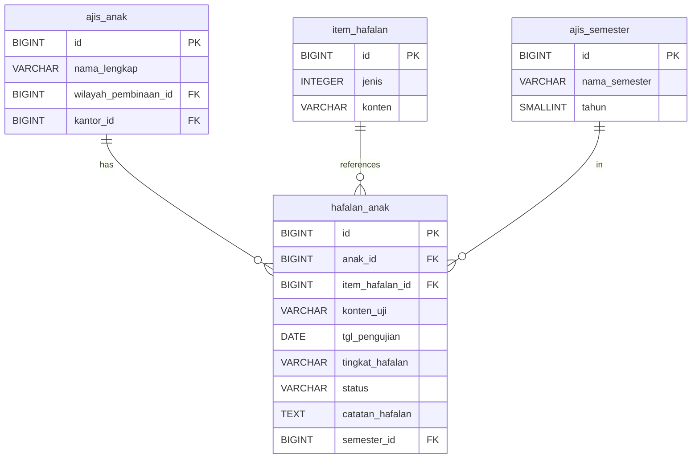

# IMPLEMENTASI MENU HAFALAN
## AJIS (Anak Juara Information System) - Quran Memorization Tracking

**Document Type:** Feature Implementation Blueprint  
**Target Audience:** Full-Stack Developers  
**Last Updated:** July 2026  
**Status:** Analysis Complete - Ready for Implementation

---

## 1. EXECUTIVE SUMMARY

Fitur Hafalan adalah modul operasional untuk mencatat dan melacak kemajuan hafalan Al-Qur'an anak-anak di bawah binaan Regional Coordinator (Korwil). Fitur ini memungkinkan pencatatan hasil ujian hafalan, tingkat kelancaran, dan catatan perkembangan per anak per semester.

**Key Objectives:**
- Mencatat hasil ujian hafalan Al-Qur'an per anak
- Melacak kemajuan hafalan dari waktu ke waktu
- Mengelola master data item hafalan (surah, juz, halaman)
- Menyediakan laporan perkembangan hafalan per semester
- Mendukung RBAC untuk Korwil (role 9)

---

## 2. DATABASE SCHEMA ANALYSIS

### 2.1 Tabel Master: item_hafalan

**Purpose:** Master data untuk item-item hafalan yang akan diuji

| Column | Type | Constraint | Notes |
|--------|------|-----------|-------|
| id | BIGSERIAL | PK | Auto-incremented ID |
| kode_lama | INTEGER | UNIQUE | Legacy ID untuk migrasi |
| jenis | INTEGER | - | Tipe hafalan (1=surah, 2=juz, 3=halaman, dll) |
| konten | VARCHAR(100) | NOT NULL | Konten hafalan (nama surah, nomor juz, halaman) |

**Indexes:**
- UNIQUE on (kode_lama)

**Sample Data:**
```sql
INSERT INTO item_hafalan (jenis, konten) VALUES
(1, 'Al-Fatihah'),
(1, 'Al-Baqarah'),
(2, 'Juz 30'),
(3, 'Halaman 1');
```

### 2.2 Tabel Transaksional: hafalan_anak

**Purpose:** Mencatat hasil ujian hafalan per anak

| Column | Type | Constraint | Notes |
|--------|------|-----------|-------|
| id | BIGSERIAL | PK | Auto-incremented ID |
| kode_lama | INTEGER | UNIQUE | Legacy ID untuk migrasi |
| anak_id | BIGINT | FK → ajis_anak(id), NOT NULL, ON DELETE CASCADE | Anak yang diuji |
| item_hafalan_id | BIGINT | FK → item_hafalan(id), ON DELETE SET NULL | Item hafalan yang diuji |
| jenis | VARCHAR(50) | - | Jenis hafalan (opsional, bisa diambil dari master) |
| konten_uji | VARCHAR(100) | NOT NULL | Konten spesifik yang diuji |
| tgl_pengujian | DATE | - | Tanggal ujian dilaksanakan |
| tingkat_hafalan | VARCHAR(50) | - | Tingkat kelancaran (lancar, setengah, belum) |
| status | VARCHAR(50) | - | Status ujian (lulus, perlu ulang, dll) |
| catatan_hafalan | TEXT | - | Catatan tambahan dari penguji |
| semester_id | BIGINT | FK → ajis_semester(id), ON DELETE SET NULL | Semester pencatatan |
| external_ref | JSONB | - | Data eksternal/referensi tambahan |

**Indexes:**
- Composite: idx_hafalan_anak_semester ON (anak_id, semester_id)
- UNIQUE on (anak_id, konten_uji) - mencegah duplikasi ujian yang sama

**RBAC Filter:**
- Query harus difilter berdasarkan `anak.wilayah_pembinaan_id` sesuai role Korwil

### 2.3 Relasi Database



---

## 3. RBAC & ACCESS CONTROL

### 3.1 Role Permissions

| Role | ID | Access Level | Permissions |
|------|----|--------------|-------------|
| **Super Admin** | 1 | Full Access | CRUD semua data hafalan, master data item hafalan |
| **Branch Admin** | 2 | Office Scope | Read-only hafalan di kantornya, CRUD item hafalan |
| **Korwil** | 9 | Regional Scope | CRUD hafalan di wilayahnya, Read-only item hafalan |

### 3.2 Data Scoping

**Korwil (Role 9):**
```typescript
// Filter hafalan berdasarkan wilayah pembinaan anak
const whereClause = inArray(
  ajisAnak.wilayahPembinaanId, 
  user.id_wilayah_pembinaan
);

// Query dengan JOIN ke ajis_anak
const hafalan = await db
  .select()
  .from(hafalanAnak)
  .innerJoin(ajisAnak, eq(hafalanAnak.anakId, ajisAnak.id))
  .where(whereClause);
```

**Branch Admin (Role 2):**
```typescript
// Filter hafalan berdasarkan kantor anak
const whereClause = eq(ajisAnak.kantorId, user.kantor_id);
```

**Super Admin (Role 1):**
```typescript
// Tidak ada filter, akses semua data
const hafalan = await db.select().from(hafalanAnak);
```

---

## 4. FEATURE REQUIREMENTS

### 4.1 Functional Requirements

**FR-1: List Hafalan**
- Menampilkan daftar hasil ujian hafalan per anak
- Filter berdasarkan semester, wilayah, anak
- Search berdasarkan nama anak atau konten hafalan
- Pagination (20 rows per page)
- Sort berdasarkan tanggal pengujian (descending)

**FR-2: Create Hafalan**
- Form untuk mencatat hasil ujian hafalan baru
- Pilih anak dari dropdown (filtered by wilayah)
- Pilih atau input item hafalan (surah/juz/halaman)
- Input tanggal pengujian
- Pilih tingkat hafalan (dropdown: lancar, setengah, belum)
- Input status (dropdown: lulus, perlu ulang, dll)
- Input catatan opsional
- Pilih semester (default: semester aktif)

**FR-3: Edit Hafalan**
- Edit data hafalan yang sudah ada
- Validasi: hanya Korwil yang memiliki akses ke wilayah anak
- Audit trail: catat user_update dan date_update

**FR-4: Delete Hafalan**
- Soft delete atau hard delete (perlu klarifikasi)
- Validasi RBAC sebelum delete
- Konfirmasi dialog sebelum delete

**FR-5: Master Data Item Hafalan**
- CRUD item hafalan (Super Admin & Branch Admin)
- Kategorisasi berdasarkan jenis (surah, juz, halaman)
- Aktif/non-aktif item

**FR-6: Laporan Perkembangan Hafalan**
- Laporan per anak per semester
- Grafik perkembangan hafalan dari waktu ke waktu
- Export ke PDF/Excel (opsional)

### 4.2 Non-Functional Requirements

**NFR-1: Performance**
- Loading list < 500ms dengan 1000+ records
- Server-side pagination mandatory
- Gunakan index idx_hafalan_anak_semester

**NFR-2: Security**
- RBAC enforcement di server actions
- Validasi anak dalam wilayah user sebelum create/update
- Audit logging untuk semua operasi

**NFR-3: UX**
- Responsive design (mobile/tablet/desktop)
- Form validation client-side (Zod + React Hook Form)
- Toast notifications untuk feedback
- Loading states untuk async operations

---

## 5. TECHNICAL IMPLEMENTATION PLAN

### 5.1 Folder Structure

```
app/
├── (dashboard)/
│   └── hafalan/
│       ├── page.tsx                      # List hafalan dengan pagination
│       ├── [id]/
│       │   ├── page.tsx                  # Detail hafalan
│       │   └── edit/
│       │       └── page.tsx              # Edit form
│       ├── create/
│       │   └── page.tsx                  # Create form
│       └── components/
│           ├── hafalan-table.tsx         # Table component
│           ├── hafalan-filters.tsx       # Filter controls
│           ├── hafalan-form.tsx          # Form component (create/edit)
│           └── item-hafalan-select.tsx   # Dropdown item hafalan

actions/
└── hafalan.ts                             # Server actions (CRUD hafalan)

lib/
├── repositories/
│   └── hafalan.repository.ts             # Repository pattern
├── validation/
│   └── schemas.ts                         # Zod schemas (hafalanSchema)
└── rbac/
    └── filters.ts                         # RBAC WHERE clause builders
```

### 5.2 Zod Validation Schemas

```typescript
// lib/validation/schemas.ts

// Schema untuk create hafalan
export const hafalanCreateSchema = z.object({
  anakId: z.number().positive("Anak harus dipilih"),
  itemHafalanId: z.number().positive().optional(),
  jenis: z.string().max(50).optional(),
  kontenUji: z.string().min(1).max(100, "Konten uji wajib diisi"),
  tglPengujian: z.string().optional(), // YYYY-MM-DD format
  tingkatHafalan: z.enum(["lancar", "setengah", "belum"]).optional(),
  status: z.string().max(50).optional(),
  catatanHafalan: z.string().max(1000).optional(),
  semesterId: z.number().positive("Semester harus dipilih"),
});

// Schema untuk update hafalan
export const hafalanUpdateSchema = hafalanCreateSchema.partial();

// Schema untuk item hafalan (master data)
export const itemHafalanSchema = z.object({
  jenis: z.number().positive("Jenis harus dipilih"),
  konten: z.string().min(1).max(100, "Konten wajib diisi"),
  aktif: z.enum(["y", "n"]).default("y"),
});
```

### 5.3 Server Actions Pattern

```typescript
// app/actions/hafalan.ts
"use server";

import { auth } from "@/lib/auth";
import { db } from "@/lib/db";
import { hafalanAnak, ajisAnak } from "@/lib/db/schema";
import { hafalanCreateSchema, hafalanUpdateSchema } from "@/lib/validation/schemas";
import { eq, and, inArray } from "drizzle-orm";

export async function createHafalanAction(data: z.infer<typeof hafalanCreateSchema>) {
  try {
    const session = await auth();
    if (!session?.user) {
      return { success: false, error: 'Unauthorized' };
    }

    // Validasi input
    const validatedData = hafalanCreateSchema.parse(data);

    // RBAC Check: Pastikan anak dalam wilayah user
    const user = {
      id_group_user: session.user.id_group_user,
      id_kantor: session.user.kantor_id,
      id_wilayah_pembinaan: session.user.id_wilayah_pembinaan,
    };

    if (user.id_group_user === 9) {
      // Korwil: cek anak dalam wilayah
      const [anak] = await db
        .select()
        .from(ajisAnak)
        .where(
          and(
            eq(ajisAnak.id, BigInt(validatedData.anakId)),
            inArray(ajisAnak.wilayahPembinaanId, user.id_wilayah_pembinaan.map(BigInt))
          )
        )
        .limit(1);

      if (!anak) {
        return { success: false, error: 'Anak tidak ditemukan di wilayah Anda' };
      }
    }

    // Insert hafalan
    const newHafalan = await db.insert(hafalanAnak).values({
      anakId: BigInt(validatedData.anakId),
      itemHafalanId: validatedData.itemHafalanId ? BigInt(validatedData.itemHafalanId) : null,
      jenis: validatedData.jenis,
      kontenUji: validatedData.kontenUji,
      tglPengujian: validatedData.tglPengujian ? new Date(validatedData.tglPengujian) : null,
      tingkatHafalan: validatedData.tingkatHafalan,
      status: validatedData.status,
      catatanHafalan: validatedData.catatanHafalan,
      semesterId: validatedData.semesterId ? BigInt(validatedData.semesterId) : null,
      userInsert: session.user.username,
      dateInsert: new Date(),
    }).returning();

    revalidatePath('/dashboard/hafalan');
    revalidatePath(`/dashboard/anak/${validatedData.anakId}`);

    return { success: true, data: newHafalan[0] };
  } catch (error) {
    console.error('Error creating hafalan:', error);
    return { success: false, error: 'Terjadi kesalahan saat menyimpan hafalan' };
  }
}

export async function getHafalanList(params: {
  page: number;
  pageSize: number;
  semesterId?: number;
  anakId?: number;
}) {
  const session = await auth();
  if (!session?.user) {
    return { success: false, error: 'Unauthorized' };
  }

  const { page, pageSize, semesterId, anakId } = params;
  const offset = (page - 1) * pageSize;

  // Build RBAC filter
  let whereCondition;
  const user = {
    id_group_user: session.user.id_group_user,
    id_kantor: session.user.kantor_id,
    id_wilayah_pembinaan: session.user.id_wilayah_pembinaan,
  };

  if (user.id_group_user === 9) {
    // Korwil: filter by wilayah
    whereCondition = inArray(ajisAnak.wilayahPembinaanId, user.id_wilayah_pembinaan.map(BigInt));
  } else if (user.id_group_user === 2) {
    // Branch Admin: filter by kantor
    whereCondition = eq(ajisAnak.kantorId, BigInt(user.id_kantor));
  }
  // Super Admin: no filter

  // Apply additional filters
  const conditions = [];
  if (whereCondition) conditions.push(whereCondition);
  if (semesterId) conditions.push(eq(hafalanAnak.semesterId, BigInt(semesterId)));
  if (anakId) conditions.push(eq(hafalanAnak.anakId, BigInt(anakId)));

  const [data, total] = await Promise.all([
    db
      .select()
      .from(hafalanAnak)
      .innerJoin(ajisAnak, eq(hafalanAnak.anakId, ajisAnak.id))
      .where(conditions.length > 0 ? and(...conditions) : undefined)
      .limit(pageSize)
      .offset(offset)
      .orderBy(desc(hafalanAnak.tglPengujian)),
    db
      .select({ count: sql`count(*)` })
      .from(hafalanAnak)
      .innerJoin(ajisAnak, eq(hafalanAnak.anakId, ajisAnak.id))
      .where(conditions.length > 0 ? and(...conditions) : undefined)
      .then(r => Number(r[0].count))
  ]);

  return {
    success: true,
    data,
    total,
    page,
    pageSize,
    totalPages: Math.ceil(total / pageSize)
  };
}
```

### 5.4 UI Components Structure

**Hafalan Table Component:**
```typescript
// app/(dashboard)/hafalan/components/hafalan-table.tsx
"use client";

import { HafalanActions } from "./hafalan-actions";

interface HafalanTableProps {
  data: HafalanWithAnak[];
  total: number;
  currentPage: number;
  onPageChange: (page: number) => void;
}

export function HafalanTable({ data, total, currentPage, onPageChange }: HafalanTableProps) {
  return (
    <div className="space-y-4">
      <Table>
        <TableHeader>
          <TableRow>
            <TableHead>Anak</TableHead>
            <TableHead>Konten Uji</TableHead>
            <TableHead>Tanggal</TableHead>
            <TableHead>Tingkat</TableHead>
            <TableHead>Status</TableHead>
            <TableHead className="text-right">Aksi</TableHead>
          </TableRow>
        </TableHeader>
        <TableBody>
          {data.map((hafalan) => (
            <TableRow key={hafalan.id}>
              <TableCell>{hafalan.anak.namaLengkap}</TableCell>
              <TableCell>{hafalan.kontenUji}</TableCell>
              <TableCell>{formatDate(hafalan.tglPengujian)}</TableCell>
              <TableCell>
                <Badge variant={getTingkatBadgeVariant(hafalan.tingkatHafalan)}>
                  {hafalan.tingkatHafalan}
                </Badge>
              </TableCell>
              <TableCell>{hafalan.status}</TableCell>
              <TableCell className="text-right">
                <HafalanActions hafalanId={hafalan.id} />
              </TableCell>
            </TableRow>
          ))}
        </TableBody>
      </Table>
      <Pagination currentPage={currentPage} total={total} onPageChange={onPageChange} />
    </div>
  );
}
```

**Hafalan Form Component:**
```typescript
// app/(dashboard)/hafalan/components/hafalan-form.tsx
"use client";

import { useForm } from "react-hook-form";
import { zodResolver } from "@hookform/resolvers/zod";
import { hafalanCreateSchema } from "@/lib/validation/schemas";
import { Button } from "@/components/ui/button";
import { Form, FormField, FormItem, FormLabel, FormControl } from "@/components/ui/form";

export function HafalanForm({ isEdit = false, initialData }: HafalanFormProps) {
  const form = useForm({
    resolver: zodResolver(hafalanCreateSchema),
    defaultValues: initialData || {
      anakId: undefined,
      itemHafalanId: undefined,
      kontenUji: "",
      tglPengujian: new Date().toISOString().split('T')[0],
      tingkatHafalan: "belum",
      status: "perlu ulang",
      semesterId: undefined,
    },
  });

  const onSubmit = async (data: z.infer<typeof hafalanCreateSchema>) => {
    const action = isEdit ? updateHafalanAction : createHafalanAction;
    const result = await action(data);
    // Handle result
  };

  return (
    <Form {...form}>
      <form onSubmit={form.handleSubmit(onSubmit)} className="space-y-4">
        <FormField
          control={form.control}
          name="anakId"
          render={({ field }) => (
            <FormItem>
              <FormLabel>Anak</FormLabel>
              <FormControl>
                <AnakSelect value={field.value} onChange={field.onChange} />
              </FormControl>
            </FormItem>
          )}
        />
        {/* More form fields */}
        <Button type="submit">Simpan</Button>
      </form>
    </Form>
  );
}
```

### 5.5 Page Components

**List Page:**
```typescript
// app/(dashboard)/hafalan/page.tsx
import { Suspense } from "react";
import { HafalanList } from "./hafalan-list";
import { HafalanTableSkeleton } from "./components/hafalan-table-skeleton";

export default async function HafalanPage(props: {
  searchParams: Promise<{ page?: string; semester?: string; anak?: string }>;
}) {
  const searchParams = await props.searchParams;
  const page = parseInt(searchParams.page || "1");
  const semesterId = searchParams.semester ? parseInt(searchParams.semester) : undefined;
  const anakId = searchParams.anak ? parseInt(searchParams.anak) : undefined;

  return (
    <div className="space-y-4">
      <div className="flex justify-between items-center">
        <h1 className="text-2xl font-bold">Data Hafalan</h1>
        <CreateHafalanButton />
      </div>

      <HafalanFilters />

      <Suspense fallback={<HafalanTableSkeleton />}>
        <HafalanList page={page} semesterId={semesterId} anakId={anakId} />
      </Suspense>
    </div>
  );
}
```

---

## 6. API ENDPOINTS

### 6.1 Server Actions

| Action | Method | Purpose | RBAC |
|--------|--------|---------|------|
| `getHafalanList` | GET | List hafalan dengan filter & pagination | All (scoped) |
| `getHafalanById` | GET | Detail satu hafalan | All (scoped) |
| `createHafalanAction` | POST | Create hafalan baru | Korwil, Super Admin |
| `updateHafalanAction` | PUT | Update hafalan existing | Korwil, Super Admin |
| `deleteHafalanAction` | DELETE | Delete hafalan | Korwil, Super Admin |
| `getItemHafalanList` | GET | List master item hafalan | All (read-only for Korwil) |
| `createItemHafalanAction` | POST | Create item hafalan | Super Admin, Branch Admin |

### 6.2 API Routes (Optional, for external integrations)

```
GET  /api/hafalan              - List hafalan
GET  /api/hafalan/:id         - Detail hafalan
POST /api/hafalan              - Create hafalan
PUT  /api/hafalan/:id         - Update hafalan
DELETE /api/hafalan/:id       - Delete hafalan

GET  /api/item-hafalan        - List item hafalan
POST /api/item-hafalan        - Create item hafalan
PUT  /api/item-hafalan/:id    - Update item hafalan
DELETE /api/item-hafalan/:id  - Delete item hafalan
```

---

## 7. VALIDATION & ERROR HANDLING

### 7.1 Client-Side Validation

- React Hook Form + Zod untuk form validation
- Real-time validation saat user input
- Error messages yang user-friendly
- Disable submit button saat invalid

### 7.2 Server-Side Validation

- Re-validate Zod schema di server action
- RBAC check sebelum database operation
- Foreign key validation (anak, semester, item_hafalan exists)
- Unique constraint check (anak_id + konten_uji)

### 7.3 Error Messages

| Error Type | Message |
|------------|---------|
| Unauthorized | "Anda tidak memiliki akses" |
| Forbidden | "Data ini berada di luar wilayah Anda" |
| Validation | "Data tidak valid: [details]" |
| Not Found | "Data hafalan tidak ditemukan" |
| Duplicate | "Ujian untuk konten ini sudah ada" |
| Database | "Terjadi kesalahan sistem" |

---

## 8. TESTING PLAN

### 8.1 Unit Tests

- Test Zod schemas validation
- Test repository methods (CRUD)
- Test RBAC filter builders

### 8.2 Integration Tests

- Test server actions dengan mock database
- Test RBAC enforcement
- Test foreign key constraints

### 8.3 E2E Tests (Playwright)

- Test flow create hafalan dari form submit
- Test filter dan pagination
- Test RBAC (Korwil hanya akses wilayahnya)
- Test edit dan delete dengan konfirmasi

### 8.4 Manual Testing Checklist

- [ ] List hafalan loads correctly
- [ ] Filter by semester works
- [ ] Search by anak name works
- [ ] Pagination works
- [ ] Create hafalan success
- [ ] Edit hafalan success
- [ ] Delete hafalan with confirmation
- [ ] RBAC: Korwil hanya lihat wilayahnya
- [ ] RBAC: Branch Admin hanya lihat kantornya
- [ ] Form validation works
- [ ] Toast notifications appear
- [ ] Responsive design on mobile

---

## 9. PERFORMANCE OPTIMIZATION

### 9.1 Database Indexes

Existing indexes (from schema):
- `idx_hafalan_anak_semester` on (anak_id, semester_id) - Composite BTREE

Additional recommended indexes:
- `idx_hafalan_tgl_pengujian` on (tgl_pengujian DESC) - BRIN untuk range queries
- `idx_hafalan_anak_wilayah` on (anak_id) untuk JOIN dengan RBAC filter

### 9.2 Query Optimization

- Server-side pagination (max 20 rows/page)
- Select only required columns (avoid SELECT *)
- Use JOIN instead of separate queries
- Cache frequently accessed data (item_hafalan, semester)

### 9.3 UI Optimization

- React Suspense untuk loading states
- Skeleton components untuk better UX
- Debounce search input
- Virtual scrolling untuk large lists (if needed)

---

## 10. DEPLOYMENT CHECKLIST

### 10.1 Pre-Deployment

- [ ] All tests pass
- [ ] RBAC verified for all roles
- [ ] Database indexes created
- [ ] Environment variables set
- [ ] Error logging configured
- [ ] Audit logging enabled

### 10.2 Post-Deployment

- [ ] Verify database connection
- [ ] Test create hafalan flow
- [ ] Test RBAC enforcement
- [ ] Monitor error logs
- [ ] Check performance metrics
- [ ] Verify revalidation paths

---

## 11. FUTURE ENHANCEMENTS

### 11.1 Phase 2 Features

- **Laporan Visual:** Grafik perkembangan hafalan per anak
- **Export/Import:** Export data hafalan ke Excel/CSV
- **Audio Recording:** Upload audio hafalan untuk review
- **Gamification:** Badge/sertifikat untuk pencapaian hafalan
- **Reminder:** Notifikasi jadwal ujian hafalan

### 11.2 Phase 3 Features

- **AI Assessment:** Auto-evaluasi kelancaran hafalan dari audio
- **Parent Portal:** Orang tua bisa lihat perkembangan anak
- **Mobile App:** Akses hafalan dari mobile app
- **Analytics:** Dashboard statistik hafalan per wilayah

---

## 12. REFERENCES

- **PRD:** `archive/docs/01_PRODUCT_REQUIREMENT_DOCUMENT.md`
- **ERD:** `archive/docs/02_ENTITY_RELATIONSHIP_DIAGRAM.md`
- **Technical Guide:** `archive/docs/03_TECHNICAL_IMPLEMENTATION_GUIDE.md`
- **Database Schema:** `db/schema.ts`
- **Database Relations:** `db/relations.ts`
- **Existing Implementation:** `app/dashboard/sesi` (reference pattern)

---

**Document Version:** 1.0  
**Last Updated:** July 2026  
**Next Review:** After implementation completion
