# AJIS PostgreSQL Entity-Relationship Diagram

Design rules applied throughout: `BIGSERIAL` primary keys (no UUIDs), `VARCHAR` + `CHECK` instead of native `ENUM`, every FK explicitly indexed, tables normalized to 3NF, and delete rules (`CASCADE` / `RESTRICT` / `SET NULL`) chosen per relationship rather than defaulted. Ten schemas (namespaces): `geography`, `organization`, `person`, `reference`, `access_control`, `program`, `sponsorship`, `activity`, `evaluation`, `finance`.

---

## Mermaid ER Diagram

```mermaid
erDiagram
    %% ===================== GEOGRAPHY =====================
    PROVINCE ||--o{ DISTRICT : "has"
    DISTRICT ||--o{ SUBDISTRICT : "has"
    SUBDISTRICT ||--o{ VILLAGE : "has"
    VILLAGE |o--o{ LOCATION : "has"

    PROVINCE {
        bigserial province_id PK
        varchar name
        boolean active
    }
    DISTRICT {
        bigserial district_id PK
        bigint province_id FK
        varchar name
    }
    SUBDISTRICT {
        bigserial subdistrict_id PK
        bigint district_id FK
        varchar name
    }
    VILLAGE {
        bigserial village_id PK
        bigint subdistrict_id FK
        varchar name
    }
    LOCATION {
        bigserial location_id PK
        bigint village_id FK "nullable"
        varchar address_text
    }

    %% ===================== ORGANIZATION =====================
    OFFICE |o--o{ OFFICE : "parent_of"
    OFFICE ||--o{ COACHING_REGION : "has"
    OFFICE ||--o{ FACILITY : "has"

    OFFICE {
        bigserial office_id PK
        bigint parent_office_id FK "nullable, self-ref"
        varchar name
        boolean active
    }
    COACHING_REGION {
        bigserial region_id PK
        bigint office_id FK
        varchar name
        boolean active
    }
    FACILITY {
        bigserial facility_id PK
        bigint office_id FK
        varchar name
        boolean active
    }

    %% ===================== PERSON =====================
    CHILD ||--o{ FAMILY_MEMBER : "has"
    CHILD ||--o{ HOUSEHOLD_MEMBER : "has"
    CHILD ||--o{ CHILD_EDUCATION : "has"
    FACILITY ||--o{ CHILD_EDUCATION : "enrolls_at"
    OFFICE |o--o{ COORDINATOR : "employs"
    ROLE ||--o{ SYSTEM_USER : "grants"
    COORDINATOR |o--o| SYSTEM_USER : "has_account"
    DONOR |o--o| SYSTEM_USER : "has_account"

    CHILD {
        bigserial child_id PK
        varchar full_name
        boolean active
    }
    FAMILY_MEMBER {
        bigserial family_member_id PK
        bigint child_id FK
        varchar relationship "CHECK: father/mother/guardian/sibling/other"
        varchar full_name
    }
    HOUSEHOLD_MEMBER {
        bigserial household_member_id PK
        bigint child_id FK
        varchar relationship
        timestamp effective_from
        timestamp effective_to "nullable = current"
    }
    CHILD_EDUCATION {
        bigserial education_id PK
        bigint child_id FK
        varchar education_level "CHECK: sd/smp/sma/other"
        varchar grade
        bigint school_id FK
        date effective_from
        date effective_to "nullable = current"
    }
    COORDINATOR {
        bigserial coordinator_id PK
        bigint office_id FK "nullable"
        varchar full_name
        varchar phone
        boolean active
    }
    DONOR {
        bigserial donor_id PK
        varchar full_name
        boolean active
    }
    SYSTEM_USER {
        bigserial system_user_id PK
        bigint coordinator_id FK "nullable, unique"
        bigint donor_id FK "nullable, unique"
        bigint role_id FK
        boolean is_system_account
        varchar username
        varchar password_hash
        boolean active
    }

    %% ===================== REFERENCE =====================
    SESSION_TYPE {
        bigserial session_type_id PK
        varchar code
        varchar name
        boolean active
    }
    ATTENDANCE_STATUS {
        bigserial attendance_status_id PK
        varchar code
        varchar name
        boolean active
    }
    WELFARE_CATEGORY {
        bigserial welfare_category_id PK
        varchar code
        varchar name
        boolean active
    }
    SEMESTER {
        bigserial semester_id PK
        varchar name
        integer year
        varchar term
        date start_date
        date end_date
    }
    ROLE {
        bigserial role_id PK
        varchar code
        varchar name
        boolean active
    }

    %% ===================== ACCESS CONTROL =====================
    ROLE ||--o{ ROLE_PERMISSION : "has"
    PERMISSION ||--o{ ROLE_PERMISSION : "granted_via"

    PERMISSION {
        bigserial permission_id PK
        varchar code
        varchar name
    }
    ROLE_PERMISSION {
        bigint role_id PK_FK
        bigint permission_id PK_FK
    }

    %% ===================== PROGRAM =====================
    PROGRAM ||--o{ CHILD_ENROLLMENT : "enrolls"
    CHILD ||--o{ CHILD_ENROLLMENT : "enrolled_in"
    WELFARE_CATEGORY ||--o{ CHILD_ENROLLMENT : "classifies"

    PROGRAM {
        bigserial program_id PK
        varchar name
        boolean active
    }
    CHILD_ENROLLMENT {
        bigserial enrollment_id PK
        bigint child_id FK
        bigint program_id FK
        bigint welfare_category_id FK
        date enrollment_date
        boolean active
    }

    %% ===================== SPONSORSHIP =====================
    CHILD ||--o{ CHILD_DONOR_PAIRING : "sponsored_by"
    DONOR ||--o{ CHILD_DONOR_PAIRING : "sponsors"
    PROGRAM ||--o{ CHILD_DONOR_PAIRING : "funds"
    CHILD_DONOR_PAIRING ||--o{ PAIRING_BALANCE_SNAPSHOT : "has"
    SEMESTER ||--o{ PAIRING_BALANCE_SNAPSHOT : "snapshot_for"

    CHILD_DONOR_PAIRING {
        bigserial pairing_id PK
        bigint child_id FK
        bigint donor_id FK
        bigint program_id FK
        date pairing_date
        date end_date "nullable"
        boolean active
    }
    PAIRING_BALANCE_SNAPSHOT {
        bigserial snapshot_id PK
        bigint pairing_id FK
        bigint semester_id FK
        numeric closing_balance
        date snapshot_date
    }

    %% ===================== ACTIVITY =====================
    COACHING_REGION ||--o{ COACHING_SESSION : "hosts"
    COORDINATOR ||--o{ COACHING_SESSION : "presents"
    SESSION_TYPE ||--o{ COACHING_SESSION : "categorizes"
    COACHING_SESSION ||--o{ SESSION_ATTENDANCE : "records"
    CHILD ||--o{ SESSION_ATTENDANCE : "attends"
    ATTENDANCE_STATUS ||--o{ SESSION_ATTENDANCE : "marks"
    SESSION_ATTENDANCE ||--o{ SESSION_HABIT_TRACKING : "tracks"
    HAFALAN_ITEM_LOOKUP ||--o{ HAFALAN_ASSESSMENT : "assessed_as"
    CHILD ||--o{ HAFALAN_ASSESSMENT : "assessed_for"
    COORDINATOR ||--o{ HAFALAN_ASSESSMENT : "assesses"

    COACHING_SESSION {
        bigserial session_id PK
        bigint location_id FK "coaching_region"
        bigint presenter_id FK "coordinator"
        bigint session_type_id FK
        date session_date
    }
    SESSION_ATTENDANCE {
        bigserial attendance_id PK
        bigint session_id FK
        bigint child_id FK
        bigint attendance_status_id FK
        jsonb child_snapshot "point-in-time copy"
    }
    SESSION_HABIT_TRACKING {
        bigserial habit_id PK
        bigint attendance_id FK
        varchar habit_type
        varchar status "CHECK: completed/partial/not_completed"
    }
    HAFALAN_ITEM_LOOKUP {
        bigserial item_id PK
        varchar name
        varchar category
        boolean active
    }
    HAFALAN_ASSESSMENT {
        bigserial assessment_id PK
        bigint item_id FK
        bigint child_id FK
        bigint assessor_id FK "coordinator"
        varchar status "CHECK: completed/partial/not_started"
        date assessed_date
    }

    %% ===================== EVALUATION =====================
    CHILD ||--o{ SEMESTER_EVALUATION : "evaluated_in"
    SEMESTER ||--o{ SEMESTER_EVALUATION : "covers"
    COORDINATOR ||--o{ SEMESTER_EVALUATION : "evaluates"
    COORDINATOR |o--o{ SEMESTER_EVALUATION : "approves"
    SEMESTER_EVALUATION ||--o{ EVALUATION_ITEM_SCORE : "scores"
    EVALUATION_ITEM ||--o{ EVALUATION_ITEM_SCORE : "scored_as"

    EVALUATION_ITEM {
        bigserial item_id PK
        varchar name
        varchar category
        boolean active
    }
    SEMESTER_EVALUATION {
        bigserial evaluation_id PK
        bigint child_id FK
        bigint semester_id FK
        bigint evaluator_id FK "coordinator"
        bigint approver_id FK "nullable, coordinator"
    }
    EVALUATION_ITEM_SCORE {
        bigserial score_id PK
        bigint evaluation_id FK
        bigint item_id FK
        numeric score "CHECK 0-100"
    }

    %% ===================== FINANCE =====================
    CHILD_DONOR_PAIRING ||--o{ TRANSACTION : "generates"

    TRANSACTION {
        bigserial transaction_id PK
        bigint pairing_id FK
        varchar transaction_type "CHECK: donation/disbursement/adjustment"
        numeric amount "CHECK > 0"
        date transaction_date
    }
```

---

## Table-by-Table Explanation

### 1. Geography schema
Immutable location hierarchy. Never cascades — deleting a parent row is blocked (`RESTRICT`) if any child rows exist, protecting historical address references.

- **province** — Top of the geographic hierarchy (Indonesian province). `name` is unique. Soft-deletable via `active`.
- **district** (kabupaten/kota) — Belongs to exactly one `province` (`province_id NOT NULL, RESTRICT`). Name is unique per province.
- **subdistrict** (kecamatan) — Belongs to exactly one `district`. Same uniqueness-per-parent pattern.
- **village** (desa/kelurahan) — Belongs to exactly one `subdistrict`. Bottom of the formal hierarchy.
- **location** — A physical address/point. `village_id` is **nullable** (supports incomplete/street-only addresses) but still `RESTRICT` on delete — a village can't be removed while any location references it. `address_text` is a free-text fallback.

### 2. Organization schema
Rumah Zakat's own structure: offices and what they operate.

- **office** — A branch/organizational unit. Self-referencing `parent_office_id` (nullable, `RESTRICT`) models the office hierarchy (e.g., regional office → branch). A `CHECK` blocks an office from being its own parent. `active` supports soft-delete instead of removing a branch outright.
- **coaching_region** (Wilayah Pembinaan) — A coaching territory assigned under one `office` (`RESTRICT` — closing an office shouldn't silently delete its regions).
- **facility** — A physical facility (e.g., a school) belonging to one `office`. Referenced later by `child_education.school_id`.

### 3. Person schema
Every human entity in the system and how they log in.

- **child** — The sponsored program participant. Deliberately minimal here (name + active flag) — the source design document didn't enumerate every demographic column, so this is the identity anchor that everything else (enrollment, sessions, evaluations, sponsorship) hangs off via `child_id`.
- **family_member** — A parent/guardian/sibling record tied to one child. `CASCADE` on delete: a family record is meaningless without its child. `relationship` is `VARCHAR` + `CHECK` (father/mother/guardian/sibling/other) rather than a native enum.
- **household_member** — Similar to `family_member` but versioned over time (`effective_from`/`effective_to`, nullable = currently valid) — supports tracking who lived in the household at a given point in time. `CASCADE` on child delete.
- **child_education** — The worked example of the system's temporal pattern: one row per schooling period, with `effective_from`/`effective_to` marking validity windows. `child_id` is `CASCADE` (dependent on the child); `school_id → facility` is `RESTRICT` (a school shouldn't vanish out from under historical enrollment records). `education_level` is the second field explicitly converted from `ENUM` to `VARCHAR` + `CHECK` (sd/smp/sma/other).
- **coordinator** — A volunteer/staff coordinator (Korwil), optionally tied to an `office` (`SET`-free `RESTRICT`, nullable). Referenced heavily downstream as the "who did this" actor (session presenter, evaluator, assessor).
- **donor** — A sponsor/donor identity. Kept separate from `system_user` because not every donor logs in.
- **system_user** — Login/account record. Can belong to a `coordinator`, a `donor`, or be a pure system/admin account — enforced by `chk_system_user_owner` (at least one of the three must be true) plus `is_system_account`. Both `coordinator_id` and `donor_id` are nullable **and** `UNIQUE`, which is what turns the relationship into a true 1-to-(zero-or-one). `role_id → reference.role` is `NOT NULL, RESTRICT` (can't delete a role while accounts hold it).

### 4. Reference schema
Small, stable lookup tables — the "enum replacements." All use a stable `code` (for application logic) plus a human-readable `name` (for display/localization), and are `RESTRICT`-protected so a lookup value can't be deleted while anything still refers to it.

- **session_type** — Coaching session categories (Reguler, Edukasi Pekanan, P3A, Parenting).
- **attendance_status** — Attendance states (Hadir/Izin/Alfa).
- **welfare_category** — Zakat-eligibility classification (Yatim/Piatu/Dhuafa).
- **semester** — A school-term period with real `start_date`/`end_date` (`CHECK end_date > start_date`) and a `(year, term)` uniqueness constraint — replaces the free-text semester labels in the legacy schema.
- **role** — System roles (Super Admin / Branch Admin / Coordinator), the parent of both `system_user.role_id` and `role_permission`.

### 5. Access Control schema
Role-based permissions, separate from the coarser row-level data scoping used elsewhere in the app.

- **permission** — A named capability (e.g., `read_child`, `edit_child`).
- **role_permission** — Junction table linking roles to permissions. Uses a **composite primary key** `(role_id, permission_id)` instead of a surrogate key, since the row has no attributes of its own beyond the pairing. `role_id → CASCADE` (permissions are attributes of the role); `permission_id → RESTRICT` (can't delete a permission still assigned to a role).

### 6. Program schema
What program a child is in and their eligibility status within it.

- **program** — A named program (e.g., Anak Juara). Supports the system eventually running more than one program.
- **child_enrollment** — Links a `child` to a `program` under a `welfare_category`, with an `enrollment_date`. `child_id → CASCADE` (enrollment is dependent data); `program_id` and `welfare_category_id → RESTRICT` (both are reference-style parents that must not be silently orphaned).

### 7. Sponsorship schema
The donor-to-child relationship — treated with the most caution in the design, since it underpins financial records.

- **child_donor_pairing** — Links a `child`, a `donor`, and a `program` for a sponsorship period (`pairing_date`/`end_date`, `CHECK end_date >= pairing_date`). **All three FKs are `RESTRICT`, not `CASCADE`** — deleting a child or donor must not silently cascade into and erase financial history in `finance.transaction`.
- **pairing_balance_snapshot** — A point-in-time closing balance for a pairing, one per semester (`UNIQUE (pairing_id, semester_id)`). Both FKs `RESTRICT` for the same audit-preservation reason.

### 8. Activity schema
The operational heart of the system: coaching sessions and progress tracking.

- **coaching_session** — A session header: region (`location_id`), presenting coordinator (`presenter_id`), and `session_type_id`, all `RESTRICT` (preserve historical record of who/where/what type). This is the header half of the legacy system's denormalized one-row-per-child session table.
- **session_attendance** — The detail half: one row per child per session. `session_id` and `child_id` are `CASCADE` (attendance only exists because of a session and a child); `attendance_status_id → RESTRICT`. `UNIQUE (session_id, child_id)` prevents duplicate attendance submissions. `child_snapshot JSONB` stores a point-in-time copy of relevant child attributes (with a `GIN` index) so historical reports aren't affected by later profile edits.
- **session_habit_tracking** — Per-attendance "Mandiri" habit rows (prayer, recitation, charity, etc.), `CASCADE` from `session_attendance`. `status` is `VARCHAR` + `CHECK` (completed/partial/not_completed) instead of an enum.
- **hafalan_item_lookup** — Master list of memorization items (Qur'an surah, prayer, du'a), soft-deletable.
- **hafalan_assessment** — One assessment row per child per item (`UNIQUE (child_id, item_id)`), `item_id → RESTRICT` (preserve historical item definitions even if retired), `child_id → CASCADE`, `assessor_id → coordinator, RESTRICT`. `status` is `VARCHAR` + `CHECK` (completed/partial/not_started).

### 9. Evaluation schema
Semester report cards, generated from activity + hafalan data and refined by coordinators.

- **evaluation_item** — Master list of evaluation aspects (e.g., Akhlak, Prestasi Akademik).
- **semester_evaluation** — One evaluation per child per semester (`UNIQUE (child_id, semester_id)`). `child_id → CASCADE`; `semester_id`, `evaluator_id`, and `approver_id` (nullable) are all `RESTRICT` — deliberately rejecting `SET NULL` on `approver_id` because that would lose who approved a report.
- **evaluation_item_score** — Per-item scores within an evaluation, `UNIQUE (evaluation_id, item_id)`, `evaluation_id → CASCADE` (scores are detail of the evaluation), `item_id → RESTRICT`. `CHECK (score BETWEEN 0 AND 100)`.

### 10. Finance schema
The most tightly guarded schema — no cascades, no physical deletes.

- **transaction** — A single donation, disbursement, or adjustment tied to a `child_donor_pairing` (`RESTRICT` — the one non-negotiable rule in the whole design, since cascading here would be an accounting-standards violation). `transaction_type` is the other field explicitly converted from `ENUM` to `VARCHAR` + `CHECK` (donation/disbursement/adjustment). `amount` is `NUMERIC(14,2)` — never floating point — with `CHECK (amount > 0)`. No `updated_at`: financial rows are meant to be application-level immutable.

---

## Indexing Notes

PostgreSQL indexes primary keys automatically but **not** foreign keys, so every FK column above gets an explicit `CREATE INDEX` — required both for `RESTRICT`/`CASCADE` delete checks (which scan the child table) and because nearly every real query pattern in AJIS is a lookup by FK (sessions by region, attendance by child, transactions by pairing). Composite/unique indexes are added wherever a table implies a business uniqueness rule (one evaluation per child per semester, one attendance row per child per session, one snapshot per pairing per semester), and a `GIN` index supports the `JSONB` `child_snapshot` column on `session_attendance`.
